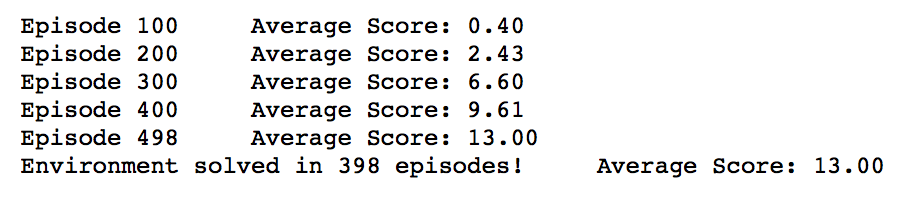
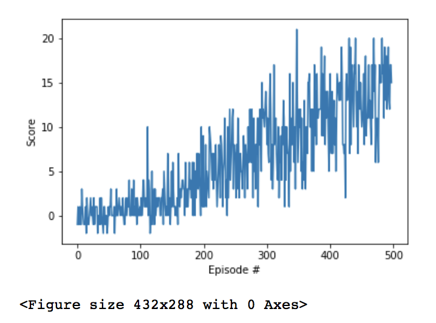

[//]: # (Image References)

[image1]: https://user-images.githubusercontent.com/10624937/42135619-d90f2f28-7d12-11e8-8823-82b970a54d7e.gif "Trained Agent"

# Project 1: Navigation

### Introduction

For this project, I trained an agent to navigate (and collect bananas!) in a large, square world.  

![Trained Agent][image1]

A reward of +1 is provided for collecting a yellow banana, and a reward of -1 is provided for collecting a blue banana.  Thus, the goal of this agent is to collect as many yellow bananas as possible while avoiding blue bananas.  

The state space has 37 dimensions and contains the agent's velocity, along with ray-based perception of objects around agent's forward direction.  Given this information, the agent learnt how to best select actions.  Four discrete actions are available, corresponding to:
- **`0`** - move forward.
- **`1`** - move backward.
- **`2`** - turn left.
- **`3`** - turn right.

The task is episodic, and in order to solve the environment, the agent got an average score of +13 over 100 consecutive episodes.

### Code

Navigation.ipynb - contains the code to interact with the environment, calling trained agent and updating overall reward.
dqn_agent.py - contains code to train the agent using double dqn method
model.py - contains network used to attain weights 

### Learning Algorithm

First I trained the agent using deep Q-network which solved the environment in 498 episodes. Next, I implemented double DQN network and this improved by solving the environment in 398 episodes. 

Hyper parameters used for double DQN network are:
- n_episodes=2000
- max_t=1000 
- eps_start=1.0 
- eps_end=0.01 
- eps_decay=0.995
- Tau = 1e-3
- gamma = 0.99
- learning_rate = 5e-4

DQN training agent code can be found in dqn_agent.py file. To implement double DQN, I changed TD target to get Q_target value for maximum reward action from Q_local. The code for this can be found in line 88-92 of dqn_agent.py. 

Two fully connected layers with 'relu' activation neural network architecture is used for the model which can be found in model.py file. 

Trained_agent.MOV is a video of the trained agent using double DQN method.

### Training Results

### Plot of Rewards

Below is a plot of rewards per episode for traing which illustrates that the agent is able to receive an average reward (over 100 episodes) of at least +13.

### Ideas for Future Work

To improve the agent, I would like to try Dueling and Prioritized Experience Replay methods. I would like to compare performances with these methods to DQN and Double DQN methods.

I would also like to try different neural network architectures to see how that will impact performance.
